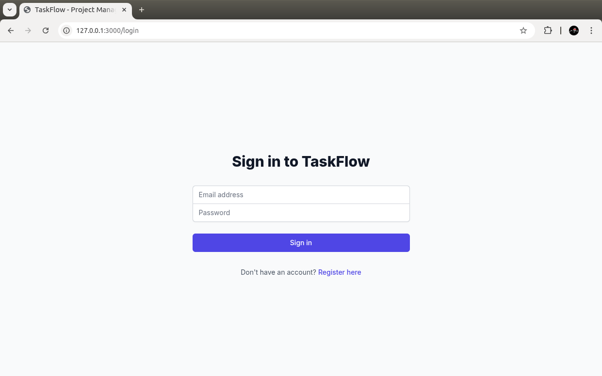
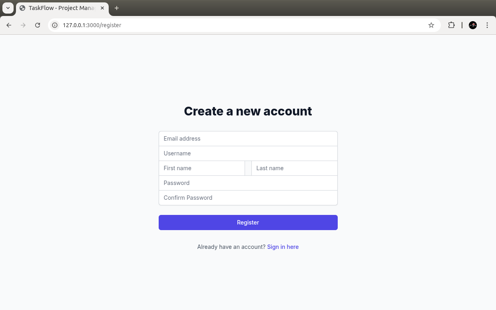
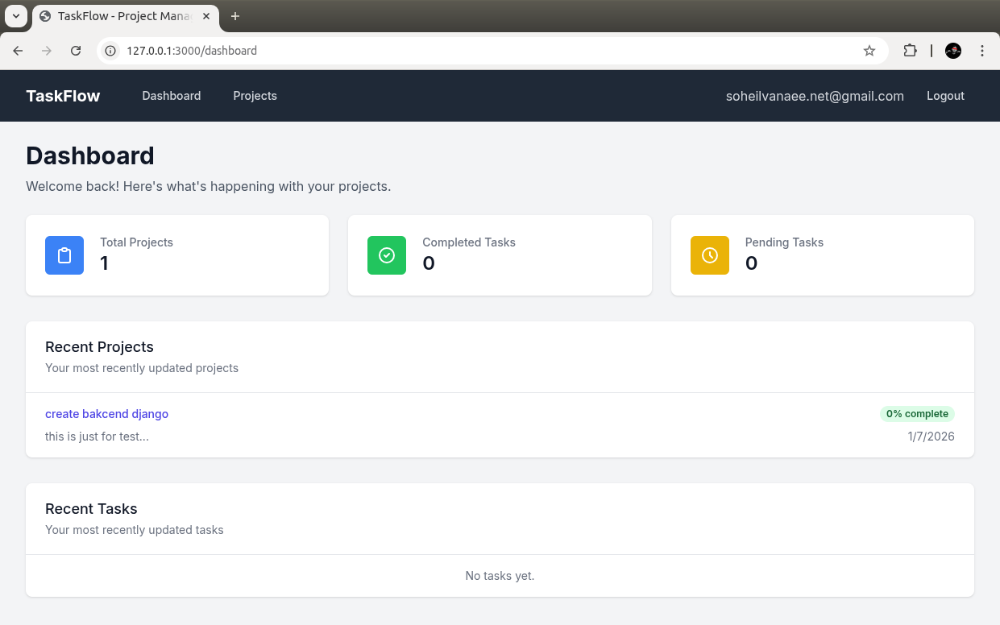
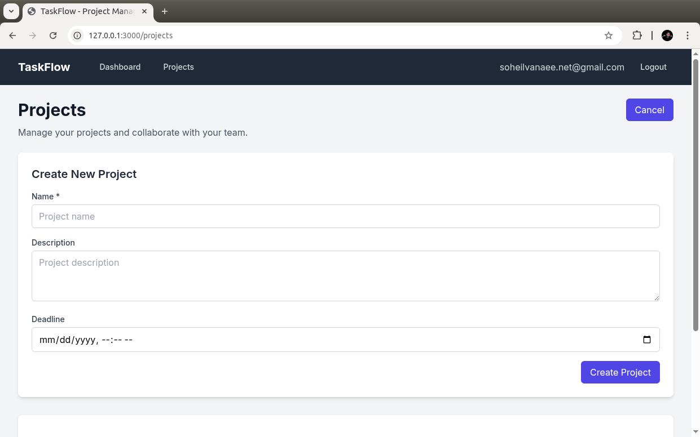
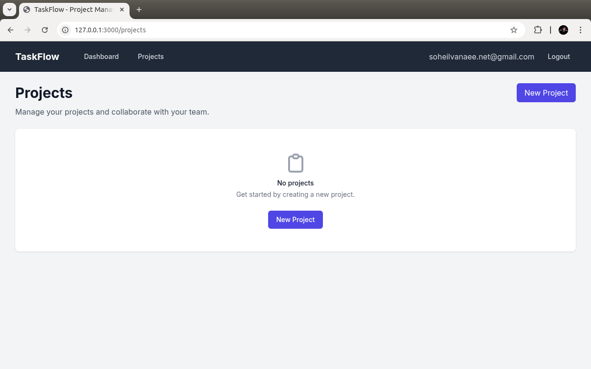

# TaskFlow - Project & Task Management System

[](https://www.djangoproject.com/)
[](https://www.python.org/)
[](LICENSE)

TaskFlow is a comprehensive project and task management system built with Django and Django REST Framework. It provides teams with a powerful platform to organize, track, and collaborate on projects and tasks efficiently.

## Features

- **User Management**: Role-based authentication with owner and member roles
- **Project Management**: Create, manage, and organize projects with deadlines
- **Task Management**: Detailed task tracking with status, priority, and assignment
- **Team Collaboration**: Add team members to projects and assign tasks
- **Task Dependencies**: Define dependencies between tasks for better workflow
- **Subscription Plans**: Tiered subscription system for feature access
- **Activity Logging**: Track user activities and system events
- **Notifications**: Automated reminders and notifications
- **API Documentation**: Comprehensive API documentation with DRF Spectacular
- **Real-time Updates**: WebSocket support for real-time collaboration
- **Mobile Responsive**: Works seamlessly across all devices

## Tech Stack

### Backend
- **Framework**: Django 5.2.10
- **API**: Django REST Framework
- **Authentication**: JWT (JSON Web Tokens)
- **Database**: SQLite (with support for PostgreSQL/MySQL)
- **Asynchronous Tasks**: Celery with Redis
- **Caching**: Redis
- **Email**: SMTP Integration

### Frontend
- **Framework**: React.js
- **Styling**: Bootstrap CSS with Material Design principles
- **State Management**: Redux/Context API

### Infrastructure
- **Development**: Docker support
- **Testing**: pytest-django
- **API Documentation**: drf-spectacular
- **Code Quality**: flake8, black

## Screenshots

<div align="center">
  
  
  
  
  
</div>

## Quick Start

### Prerequisites
- Python 3.8+
- Node.js 16+
- Redis server
- Git

### Installation

1. **Clone the repository**
```bash
https://github.com/soheil-vanaee/taskflow.git
cd taskflow-project
```

2. **Set up environment variables**
```bash
cd taskflow
cp .env.example .env
# Edit .env with your configuration
```

3. **Run the development environment**
```bash
# Make the script executable
chmod +x run-dev.sh

# Start both backend and frontend
./run-dev.sh
```

The application will be available at:
- Backend API: http://127.0.0.1:8000
- Frontend: http://127.0.0.1:3000
- API Documentation: http://127.0.0.1:8000/api/schema/swagger-ui/

### Manual Setup

#### Backend Setup
```bash
cd taskflow

# Create virtual environment
python -m venv venv
source venv/bin/activate  # On Windows: venv\Scripts\activate

# Install dependencies
pip install -r requirements.txt

# Run migrations
python manage.py migrate

# Create superuser (optional)
python manage.py createsuperuser

# Load sample data (optional)
python manage.py runscript seed_data

# Start the development server
python manage.py runserver
```

#### Frontend Setup
```bash
cd taskflow-frontend

# Install dependencies
npm install

# Start development server
npm run dev
```

## API Endpoints

### Authentication
- `POST /api/auth/login/` - User login
- `POST /api/auth/register/` - User registration
- `POST /api/auth/logout/` - User logout
- `POST /api/auth/refresh/` - Refresh JWT token

### Projects
- `GET /api/projects/` - List projects
- `POST /api/projects/` - Create project
- `GET /api/projects/{id}/` - Get project details
- `PUT /api/projects/{id}/` - Update project
- `DELETE /api/projects/{id}/` - Delete project

### Tasks
- `GET /api/tasks/` - List tasks
- `POST /api/tasks/` - Create task
- `GET /api/tasks/{id}/` - Get task details
- `PUT /api/tasks/{id}/` - Update task
- `DELETE /api/tasks/{id}/` - Delete task

### Users
- `GET /api/users/` - List users
- `GET /api/users/{id}/` - Get user profile
- `PUT /api/users/{id}/` - Update user profile

For complete API documentation, visit: http://127.0.0.1:8000/api/schema/swagger-ui/

## Testing

Run the test suite:
```bash
cd taskflow
source venv/bin/activate
python manage.py test
```

## Configuration

### Environment Variables
Create a `.env` file in the `taskflow` directory with the following variables:

```env
SECRET_KEY=your-super-secret-key-here
DEBUG=True
JWT_SECRET_KEY=your-jwt-secret-key
CELERY_BROKER_URL=redis://localhost:6379/0
CELERY_RESULT_BACKEND=redis://localhost:6379/0
EMAIL_HOST=smtp.gmail.com
EMAIL_PORT=587
EMAIL_HOST_USER=your-email@gmail.com
EMAIL_HOST_PASSWORD=your-app-password
EMAIL_USE_TLS=True
```

### Celery Worker
For background task processing:
```bash
cd taskflow
source venv/bin/activate
celery -A taskflow_project worker --loglevel=info
```

### Celery Beat (Scheduler)
For scheduled tasks:
```bash
cd taskflow
source venv/bin/activate
celery -A taskflow_project beat --loglevel=info
```

## Database Models

### User
- Email (unique)
- Username
- First Name, Last Name
- Role (Owner, Member)
- Profile picture
- Subscription status

### Project
- Name
- Description
- Deadline
- Owner
- Members (many-to-many with User)
- Created/updated timestamps

### Task
- Title
- Description
- Status (To Do, In Progress, Completed)
- Priority (Low, Medium, High)
- Deadline
- Project (foreign key)
- Assignee (foreign key to User)
- Dependencies (many-to-many with Task)
- Created/updated timestamps

## Deployment

### Production Setup
1. Set `DEBUG=False` in settings
2. Configure proper database (PostgreSQL recommended)
3. Set up proper email configuration
4. Configure SSL certificates
5. Set up reverse proxy (nginx)

### Docker Support
```bash
# Build and run with Docker
docker-compose up --build
```

## Contributing

1. Fork the repository
2. Create a feature branch (`git checkout -b feature/amazing-feature`)
3. Make your changes
4. Add tests if applicable
5. Commit your changes (`git commit -m 'Add amazing feature'`)
6. Push to the branch (`git push origin feature/amazing-feature`)
7. Open a Pull Request

## License

This project is licensed under the MIT License - see the [LICENSE](LICENSE) file for details.

## Issues & Support

If you encounter any issues or have questions, please [open an issue](https://github.com/soheil-vanaee/taskflow.git) on GitHub.

## Acknowledgments

- Built with [Django](https://www.djangoproject.com/)
- API powered by [Django REST Framework](https://www.django-rest-framework.org/)
- Frontend built with [React](https://reactjs.org/)
- Icons from [Feather Icons](https://feathericons.com/)

